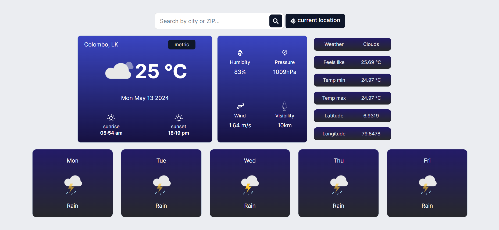

## Weather App

A simple weather application that retrieves current weather data and upcoming weather data for upto 5 days via OpenWeatherMap's weather API.

## Pre-requisites and installation

1. clone the repo to your local development environment 
   `git clone https://github.com/lasanseniya/weather-app-react.git`

2. Install the packages in both frontend and backend via,  
   `npm install`

3. start the dev frontend via,  
   `npm run dev`

4. visit the url `http://localhost:5173` on your browser to view the output

 

## Tech Stack

 

## UI

 
